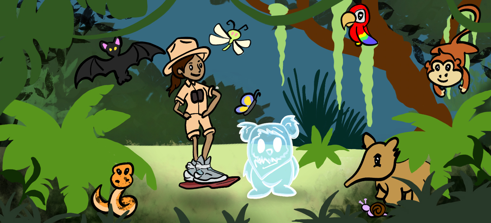

```{r setup, include=FALSE}
knitr::opts_chunk$set(message = FALSE, warning = FALSE)
library(flexdashboard)
library(knitr)
library(kableExtra)
library(palettetown)
source("dashboard/DataPrep.R")
```

Dinosaurs
=====================================  

Column {data-width=600}
-------------------------------------
    
### Sentiment
    
```{r}
comparison.cloud(question_4,
                 colors = sent_pal,
                 max.words = 100, scale=c(3.5,0.50))
```
   
Column {data-width=400}
-------------------------------------

```{r  out.width = "100%"}
 
```

### Career Stage

```{r  out.width = "100%"}

survey %>%
  filter(`Translated to` == "EN") %>%
  count(`What is your career stage?`) %>%
  na.omit() %>%
  summarise(percentage = n/sum(n)*100,
            stage = `What is your career stage?`) %>%
  ggplot() +
  geom_col(aes(x = 2,
               y = percentage,
               fill = stage)) +
  xlim(c(0.7, 2.5)) +
  ylim(c(0, 100)) +
  coord_polar(theta = 'y') +
  scale_fill_poke(guide = guide_legend(title = "Career stage"),
                  pokemon = 134, spread = 6) +
  theme_void()

```

### At home?

```{r  out.width = "100%"}
survey %>%
  filter(`Translated to` == "EN") %>%
  count(`Are you studying in your home country?`) %>%
  na.omit() %>%
  summarise(percentage = n/sum(n)*100,
            home = `Are you studying in your home country?`) %>%
  ggplot() +
  geom_col(aes(x = 2,
               y = percentage,
               fill = home)) +
  xlim(c(0.7, 2.5)) +
  ylim(c(0, 100)) +
  coord_polar(theta = 'y') +
  scale_fill_poke(guide = guide_legend(title = "Studying at home?"),
                  pokemon = 13, spread = 2) +
  theme_void()
```


Past
=====================================  
    
Column {data-width=600}
-------------------------------------
    
### Sentiment
    
```{r}
comparison.cloud(question_4,
                 colors = sent_pal,
                 max.words = 100, scale=c(3.5,0.50))
```
   
Column {data-width=400}
-------------------------------------

```{r  out.width = "100%"}
 
```

### Full Responses

Note some answers have been translated from their original language or altered by the request of the correspondent
    
```{r}

survey %>%
  filter(`Translated to` == "EN") %>%
  select(`Tell us a short story about your background in science! Do you want to share an image or a video that represents your story as a tropical/subtropical ecologist? Go ahead!`) %>%
  na.omit() %>%
  kable(align = "c")%>%
  kable_styling(bootstrap_options = c("striped", "condensed","responsive", "bordered")) %>%
  row_spec(0, background = "pink", align = "c", bold = TRUE) #%>%
  #scroll_box(width = "500px", height = "400px") 

```

Present
=====================================     
   
Column {data-width=600}
-------------------------------------

### Sentiment

```{r}
comparison.cloud(question_5,
                 colors = sent_pal,
                 max.words = 100, scale=c(3.5,0.50))
```

Column {data-width=400}
-------------------------------------
   
```{r  out.width = "100%"}
 
```

### Full Responses

Note some answers have been translated from their original language or altered by the request of the correspondent
    
```{r}

survey %>%
  filter(`Translated to` == "EN") %>%
  select(`What advice would you give your past-self or a young researcher from your country?`)  %>%
  na.omit() %>%
  kable(align = "c") %>%
  kable_styling(bootstrap_options = c("striped", "condensed","responsive", "bordered")) %>%
  row_spec(0, background = "pink", align = "c", bold = TRUE) #%>%
  #scroll_box(width = "500px", height = "400px") 

```

Future
=====================================  

Column {.tabset}
-------------------------------------

### Sentiment

```{r}
comparison.cloud(question_6,
                 colors = sent_pal,
                 max.words = 100, scale=c(3.5,0.50))
```

### Sentiment - remixed
    
```{r}


```

Column {data-width=400}
-------------------------------------
   
```{r  out.width = "100%"}
 
```
   
### Full Responses

Note some answers have been translated from their original language or altered by the request of the correspondent
    
```{r}

survey %>%
  filter(`Translated to` == "EN") %>%
  select(`Describe your dream of the future as a tropical scientist in a tweet (up to 280 characters).`)  %>%
  na.omit() %>%
  kable(align = "c")%>%
  kable_styling(bootstrap_options = c("striped", "condensed","responsive", "bordered")) %>%
  row_spec(0, background = "pink", align = "c", bold = TRUE) #%>%
  #scroll_box(width = "500px", height = "400px") 

``` 